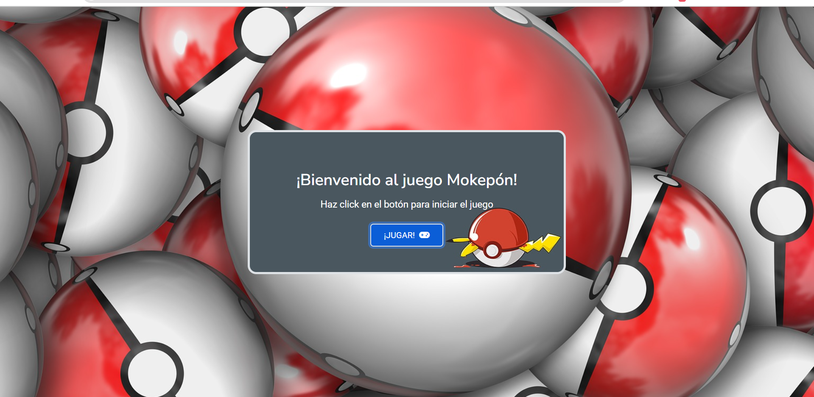
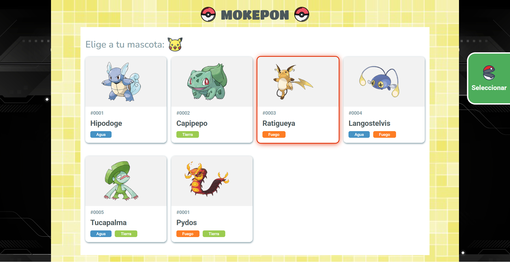
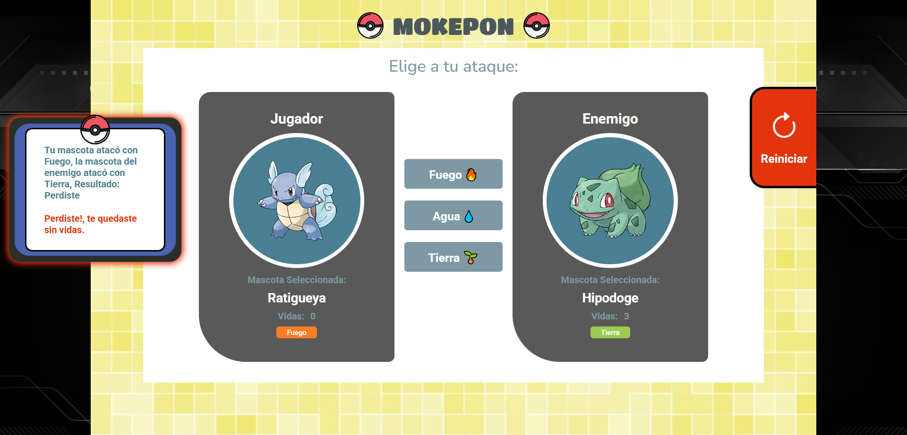

# 🎮Taller: Juego Mokepon 🎮

El videojuego ha sido elaborado durante las sesiones del curso "Programación Básica" de [Platzi](https://platzi.com) con  HTML🧡, CSS 💙y JavaScript💛 y adicionalmente se han añadido estilos CSS y código JS de mi propia autoría.

✅ Pantalla de Inicio con SweetAlert:

✅ 1era Pantalla:

✅ 2da Pantalla:

🎬 Se han elaborado los siguientes video tutoriales

|Descripción             |Enlace a video en YouTube                                                |
|----------------|-------------------------------|
|Capítulo 1 - Alineando con 💙CSS FlexBox|[Ver 👀](https://youtu.be/0R4ViLlMq9I?si=IdxAfPmlr9Y6sLRo)       |
|Capítulo 2  - Uso de 💙CSS Grid para crear las cards de los mokepones|[Ver 👀](https://youtu.be/B9RNBucB60U?si=hIEOE5eV7RrE_SpN)        |
|Capítulo 3  - Jerarquía de textos y encabezados, badges y fuentes de texto|[Ver 👀](https://youtu.be/3fUl04cOGKg?si=ntvOJmba5lgKCqiL)     
|Capítulo 4  - Animaciones con 💙CSS y uso de 💛JS para iluminar la card seleccionada|[Ver 👀](https://youtu.be/OkeeJejQ9g8?si=YoSi54D_9kWKhNZg)       |
|Capítulo 5  - Culminación de capítulo 4 |[Ver 👀](https://youtu.be/4GR0OuFKqq8?si=oojbDTB3WBh7m7m8)       |
|Capítulo 6  - Aplicación de estilos 💙CSS en pantalla 2 |[Ver 👀](https://youtu.be/NGGX1m3ellI?si=-TEiXNN2ncYbSIsb)       |
|Capítulo 7  - Posicionamiento con 💙CSS y aplicación de clases desde 💛JS |[Ver 👀](https://youtu.be/oF-fBLxPH2s?si=s1TrdYTDFGAcMXaE)       |
|Capítulo 8  - Elabora el 1° botón flotante con 💙CSS |[Ver 👀](https://youtu.be/odPlaMx92D8?si=3KVEQWf-FWtUJ-x1)       |
|Capítulo 9  - Elabora el 2° botón flotante con 💙CSS|[Ver 👀](https://youtu.be/coZcP_HOtCU?si=giGbhzTKdEZ4JMrR)       |
|Capítulo 10  - Posicionamiento con 💙CSS y uso de 💛JS para impactar la lógica de la caja de mensajes del juego |[Ver 👀](https://youtu.be/oZpMokqk_d0?si=Mctz2twihj9inixg)       |
|Capítulo 11  - Crear las tarjetas de los mokepones desde 💛JS a partir de un array de objetos |[Ver 👀](https://youtu.be/xUafUriu-20?si=motjhncpy03B1swc)       |
|Capítulo 12  - Incorpora un Sistema de vidas gráfico para el juego con 💛JS |[Ver 👀](https://youtu.be/v26ISiQKu_o?si=VrfMsrqvsKG3l23r)       |
|Capítulo 13  - Pasar información entre pantallas utilizando 💛JS |[Ver 👀](https://youtu.be/eQ29pQ3kIbc?si=9C2Yb24tCadZpMP0)       |
|Capítulo 14  -  Crear una pantalla de inicio con SweetAlert, Bootstrap y 💛JS |[Ver 👀](https://youtu.be/0X3QNwjP71Q?si=hd0CLdDuoCLa77Gt)       |
|Capítulo 15  - Transforma los mensajes de alerta con SweetAlert, Bootstrap y 💛JS |[Ver 👀](https://youtu.be/e0-dEhpHRhg)       |

_________

📌Prueba la [demo del juego 🎮](https://raulsr92.github.io/Proyecto-mokepon-platzi/mokepon) 🦔🐇🐖🦨

📌Échale un vistazo al [repositorio de GitHub](https://github.com/raulsr92/Proyecto-mokepon-platzi)  

